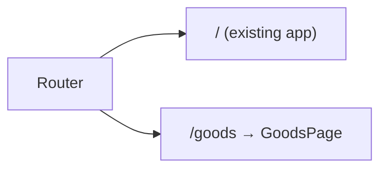

# Design Document: Goods Realtime Page

## Overview

A new `GoodsPage` component added to the existing React (Vite) frontend that displays all rows from the Supabase `goods` table in a live-updating HTML table. The page subscribes to Supabase Realtime channels so INSERT, UPDATE, and DELETE events are reflected immediately without a full re-fetch. The feature is read-only and respects RLS via the anonymous key.

The app currently has no client-side router and no instantiated `@supabase/supabase-js` client (data is fetched via raw `fetch`). This design introduces both.

### Key Design Decisions

- **Add `react-router-dom`** — the app has no router today; this is the minimal addition needed to satisfy the `/goods` route requirement without restructuring the whole app.
- **Create a shared Supabase client** — `frontend/src/lib/supabaseClient.js` instantiates the client once using `VITE_SUPABASE_URL` and `VITE_SUPABASE_ANON_KEY`. This replaces the ad-hoc raw `fetch` pattern and enables Realtime.
- **Local state mutation for realtime events** — on INSERT/UPDATE/DELETE the component mutates its local `goods` array directly rather than re-fetching, keeping the UI snappy and avoiding unnecessary round-trips.

---

## Architecture

```mermaid
graph TD
    A[App.jsx] -->|BrowserRouter + Routes| B[Route /]
    A -->|Route /goods| C[GoodsPage]
    C --> D[useGoods hook]
    D -->|initial fetch| E[supabaseClient.from('goods').select]
    D -->|subscribe| F[supabaseClient.channel realtime]
    F -->|INSERT event| D
    F -->|UPDATE event| D
    F -->|DELETE event| D
    C --> G[GoodsTable component]
    C --> H[StatusBanner component]
```

Data flow:
1. `GoodsPage` mounts → `useGoods` fetches all rows ordered by `created_at DESC`.
2. `useGoods` opens a Realtime channel on the `goods` table.
3. Events mutate the local state array; no re-fetch occurs.
4. On unmount, the channel is removed via `supabase.removeChannel()`.

---

## Components and Interfaces

### `supabaseClient.js` (lib)

```js
// frontend/src/lib/supabaseClient.js
import { createClient } from '@supabase/supabase-js'

export const supabase = createClient(
  import.meta.env.VITE_SUPABASE_URL,
  import.meta.env.VITE_SUPABASE_ANON_KEY
)
```

Single export, used by `useGoods` and any future hooks.

---

### `useGoods` hook

```
useGoods() → { goods, loading, error, realtimeStatus }
```

Responsibilities:
- Fetch initial goods list on mount (`select('*').order('created_at', { ascending: false })`)
- Subscribe to `postgres_changes` on the `goods` table for `INSERT`, `UPDATE`, `DELETE`
- Mutate local state on each event
- Track `realtimeStatus`: `'connecting' | 'connected' | 'reconnecting' | 'disconnected'`
- Unsubscribe on unmount

State shape:
```js
{
  goods: Good[],       // current list
  loading: boolean,    // true during initial fetch
  error: string|null,  // fetch error message
  realtimeStatus: 'connecting'|'connected'|'reconnecting'|'disconnected'
}
```

---

### `GoodsPage` component

Route: `/goods`

Renders:
- `StatusBanner` — shows loading spinner, error message, reconnecting indicator, or empty-state
- `GoodsTable` — the actual `<table>` when goods are available

Props: none (self-contained, uses `useGoods` internally)

---

### `GoodsTable` component

```
GoodsTable({ goods: Good[] }) → JSX
```

Renders an HTML `<table>` with columns: Title, Description, Quantity, Cost, Created At.

Formatting rules (applied inside the component):
- `created_at` → `new Date(value).toLocaleString()`
- `cost` → `$` prefix with 2 decimal places, or `—` if null
- `description` → value, or `—` if null/empty

---

### `StatusBanner` component

```
StatusBanner({ loading, error, isEmpty, realtimeStatus }) → JSX | null
```

Renders the appropriate UI state message. Returns `null` when everything is normal and goods are present.

---

### Routing changes in `App.jsx`

Wrap the existing content in a `<Route path="/">` and add `<Route path="/goods" element={<GoodsPage />} />`. Add a nav link in the `Header` (or inline in `App.jsx`) pointing to `/goods`.



---

## Data Models

### `Good` (TypeScript-style interface for reference)

```ts
interface Good {
  id: string           // uuid
  title: string
  description: string | null
  quantity: number     // integer, default 0
  cost: number | null  // numeric
  created_at: string   // timestamptz ISO string
  // embed and created_by are present in DB but not displayed
}
```

### Realtime event payload shapes

Supabase Realtime `postgres_changes` delivers:

```js
// INSERT
{ eventType: 'INSERT', new: Good, old: {} }

// UPDATE
{ eventType: 'UPDATE', new: Good, old: Good }

// DELETE
{ eventType: 'DELETE', new: {}, old: { id: string } }
```

State mutation logic:
- **INSERT**: prepend `payload.new` to goods array (maintains `created_at DESC` order for new items)
- **UPDATE**: map over array, replace item where `item.id === payload.new.id`
- **DELETE**: filter out item where `item.id === payload.old.id`

---

## Correctness Properties

*A property is a characteristic or behavior that should hold true across all valid executions of a system — essentially, a formal statement about what the system should do. Properties serve as the bridge between human-readable specifications and machine-verifiable correctness guarantees.*

### Property 1: All required columns are rendered for every Good

*For any* Good object with valid field values, the rendered `GoodsTable` row must contain the Good's `title`, `description` (or `—`), `quantity`, formatted `cost`, and formatted `created_at`.

**Validates: Requirements 1.2**

---

### Property 2: Error messages are always surfaced

*For any* non-empty error string returned by the fetch, the rendered `GoodsPage` must contain that error string somewhere in its output.

**Validates: Requirements 1.5**

---

### Property 3: Date formatter produces human-readable output

*For any* valid ISO 8601 timestamp string, `formatDate(value)` must return a non-empty string that is different from the raw input string.

**Validates: Requirements 1.6**

---

### Property 4: Cost and nullable field formatting

*For any* non-null numeric cost value, `formatCost(value)` must return a string that starts with a currency symbol (`$`). When `cost` is `null`, `formatCost(null)` must return `—`. When `description` is `null` or an empty string, `formatDescription(value)` must return `—`.

**Validates: Requirements 1.7, 1.8**

---

### Property 5: INSERT event adds the Good to the list

*For any* goods list and any new Good payload delivered via an INSERT realtime event, the resulting list must contain the new Good (matched by `id`).

**Validates: Requirements 2.2**

---

### Property 6: UPDATE event replaces the existing Good

*For any* goods list containing a Good with a given `id`, and any updated Good payload with the same `id` delivered via an UPDATE event, the resulting list must contain the updated Good and must not contain the old version.

**Validates: Requirements 2.3**

---

### Property 7: DELETE event removes the Good from the list

*For any* goods list containing a Good with a given `id`, after a DELETE event carrying that `id`, the resulting list must not contain any Good with that `id`.

**Validates: Requirements 2.4**

---

## Error Handling

| Scenario | Behaviour |
|---|---|
| Initial fetch network error | `error` state set to error message; `GoodsPage` renders error banner |
| Initial fetch returns empty array | `goods` stays `[]`; empty-state message shown (covers RLS deny-all) |
| Realtime channel `CHANNEL_ERROR` / `TIMED_OUT` | `realtimeStatus` set to `'reconnecting'`; `StatusBanner` shows reconnecting indicator |
| Realtime channel `CLOSED` | `realtimeStatus` set to `'disconnected'` |
| INSERT/UPDATE payload missing `new` | Guard clause skips mutation; no crash |
| DELETE payload missing `old.id` | Guard clause skips mutation; no crash |
| `VITE_SUPABASE_URL` / `VITE_SUPABASE_ANON_KEY` missing | `createClient` will throw at startup; developer sees console error |

The `useGoods` hook wraps the initial fetch in a `try/catch` and sets `error` state on failure. Realtime status changes are handled via the channel's system event callbacks (`SUBSCRIBED`, `CHANNEL_ERROR`, `TIMED_OUT`, `CLOSED`).

---

## Testing Strategy

### Dual Testing Approach

Both unit tests and property-based tests are required. Unit tests cover specific examples and integration points; property tests verify universal correctness across generated inputs.

### Unit Tests (Vitest + React Testing Library)

Focus areas:
- `GoodsPage` renders loading indicator when `loading: true` (Req 1.3)
- `GoodsPage` renders empty-state message when `goods: []` (Req 1.4)
- `GoodsPage` renders reconnecting banner when `realtimeStatus: 'reconnecting'` (Req 2.6)
- `useGoods` calls `supabase.channel().on()` with INSERT, UPDATE, DELETE on mount (Req 2.1)
- `useGoods` calls `supabase.removeChannel()` on unmount (Req 2.5)
- `/goods` route renders `GoodsPage` (Req 3.1)
- Nav link to `/goods` is present on the main page (Req 3.2)
- `supabaseClient.js` is initialized with `VITE_SUPABASE_ANON_KEY` (Req 4.1)

### Property-Based Tests (fast-check)

Install: `npm install --save-dev fast-check` in `frontend/`.

Each property test runs a minimum of **100 iterations**.

Tag format: `// Feature: goods-realtime-page, Property {N}: {property_text}`

```
// Feature: goods-realtime-page, Property 1: All required columns are rendered for every Good
fc.assert(fc.property(arbitraryGood(), (good) => {
  const { getByText } = render(<GoodsTable goods={[good]} />)
  expect(getByText(good.title)).toBeInTheDocument()
  // ... check all columns
}), { numRuns: 100 })

// Feature: goods-realtime-page, Property 2: Error messages are always surfaced
fc.assert(fc.property(fc.string({ minLength: 1 }), (errMsg) => {
  const { getByText } = render(<StatusBanner error={errMsg} />)
  expect(getByText(errMsg)).toBeInTheDocument()
}), { numRuns: 100 })

// Feature: goods-realtime-page, Property 3: Date formatter produces human-readable output
fc.assert(fc.property(arbitraryISODate(), (iso) => {
  const result = formatDate(iso)
  expect(result).not.toBe('')
  expect(result).not.toBe(iso)
}), { numRuns: 100 })

// Feature: goods-realtime-page, Property 4: Cost and nullable field formatting
fc.assert(fc.property(fc.float({ min: 0, max: 1e6 }), (cost) => {
  expect(formatCost(cost)).toMatch(/^\$/)
}), { numRuns: 100 })
// edge cases: formatCost(null) === '—', formatDescription(null) === '—', formatDescription('') === '—'

// Feature: goods-realtime-page, Property 5: INSERT event adds the Good to the list
fc.assert(fc.property(fc.array(arbitraryGood()), arbitraryGood(), (list, newGood) => {
  const result = applyInsert(list, newGood)
  expect(result.some(g => g.id === newGood.id)).toBe(true)
}), { numRuns: 100 })

// Feature: goods-realtime-page, Property 6: UPDATE event replaces the existing Good
fc.assert(fc.property(fc.array(arbitraryGood(), { minLength: 1 }), (list) => {
  const target = list[0]
  const updated = { ...target, title: 'updated-title' }
  const result = applyUpdate(list, updated)
  expect(result.find(g => g.id === target.id)?.title).toBe('updated-title')
}), { numRuns: 100 })

// Feature: goods-realtime-page, Property 7: DELETE event removes the Good from the list
fc.assert(fc.property(fc.array(arbitraryGood(), { minLength: 1 }), (list) => {
  const target = list[0]
  const result = applyDelete(list, target.id)
  expect(result.every(g => g.id !== target.id)).toBe(true)
}), { numRuns: 100 })
```

The pure mutation helpers (`applyInsert`, `applyUpdate`, `applyDelete`) are extracted from `useGoods` so they can be tested independently without mocking the Supabase client.
